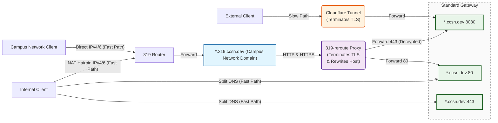

# Network Routing Architecture

This document outlines the ingress routing architecture for the cluster.
The design targets efficient handling of internal and external traffic,
using Split DNS for local access, Cloudflare Tunnel for public access, and a
direct campus/IPv4/IPv6 path via the 319 Router and 319-reroute proxy.

## Architecture Diagram

## Traffic Flows

### 1. External Access (Slow Path)

* **Route:** External Client -> Cloudflare Tunnel -> Gateway (`:8080`)
* **Description:** Provides secure public access to `*.ccsn.dev` without exposing local ports. Cloudflare handles TLS termination.

### 2. IPv6 Direct Access (Fast Path)

* **Route:** Client (Campus / Internal) -> `319 Router` -> `*.319.ccsn.dev` (Domain) -> `319-reroute Proxy` -> Gateway (`:80` or `:8080`)
* **Description:** Campus-network or NAT-hairpin internal clients reach `*.319.ccsn.dev` via the `319 Router`, which forwards requests to the `*.319.ccsn.dev` domain endpoint. That domain accepts both HTTP (80) and HTTPS (443) and hands traffic to the `319-reroute Proxy`. The proxy terminates TLS (for HTTPS), rewrites the Host header to `*.ccsn.dev`, and splits traffic: decrypted HTTPS is forwarded to the Gateway on `:8080`, while plain HTTP is forwarded to `:80`.

### 3. Internal Access (Split DNS Fast Path)

* **Route:** Internal Client -> Gateway (`:80` or `:443`)
* **Description:** Local network clients resolve `*.ccsn.dev` directly to the local gateway IP via Split DNS, avoiding proxy overhead entirely.

## Core Components

* **Cloudflare Tunnel:** Secures external IPv4/general traffic. Terminates TLS before forwarding to the local network.
* **319-reroute Proxy:** A custom reverse proxy handling the `*.319.ccsn.dev` domain. Its primary jobs are TLS termination, Host header rewriting, and HTTP/HTTPS traffic splitting.
* **Standard Gateway:** The core entry point for the backend services.

## Gateway Port Mapping

| Port | Traffic Source | Description |
| --- | --- | --- |
| **80** | Internal Split DNS, `319-reroute` | Standard plain HTTP traffic. |
| **443** | Internal Split DNS | Standard HTTPS traffic (Gateway handles TLS). |
| **8080** | Cloudflare Tunnel, `319-reroute` | Decrypted HTTPS traffic forwarded from upstream proxies. |
