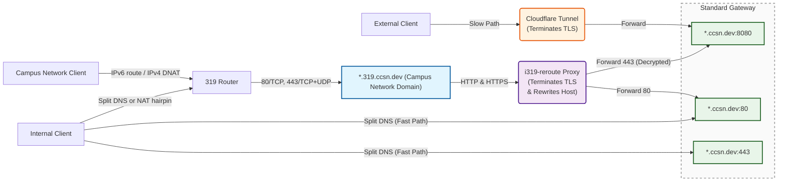

# Network Routing Architecture

This document outlines the ingress routing architecture for the cluster.
The design targets efficient handling of internal and external traffic,
using Split DNS for local access, Cloudflare Tunnel for public access, and a
direct campus dual-stack path via the 319 Router behind the campus firewall
and the i319-reroute proxy.

## Architecture Diagram


```mermaid
graph LR
    %% Clients
    Ext[External Client]
    Cam[Campus Network Client]
    Int[Internal Client]

    %% Middle Tier & Ingress
    CF_Tunnel("Cloudflare Tunnel<br/>(Terminates TLS)")
    319_router[319 Router]
    Domain_319["*.319.ccsn.dev (Campus Network Domain)"]
    319_reroute("i319-reroute Proxy<br/>(Terminates TLS<br/>& Rewrites Host)")

    %% Gateway (Rearranged node order to perfectly avoid line crossings)
    subgraph Gateway [Standard Gateway]
        GW_8080["*.ccsn.dev:8080"]
        GW_80["*.ccsn.dev:80"]
        GW_443["*.ccsn.dev:443"]
    end

    %% --- 1. Top Path ---
    Ext -->|"Slow Path"| CF_Tunnel
    CF_Tunnel -->|"Forward"| GW_8080

    %% --- 2. Middle Path (Includes i319-reroute routing) ---
    Cam -->|"IPv6 route / IPv4 DNAT"| 319_router
    Int -->|"Split DNS or NAT hairpin"| 319_router
    319_router -->|"80/TCP, 443/TCP+UDP"| Domain_319
    
    %% Domain receives 80 & 443 traffic and passes it to the proxy
    Domain_319 -->|"HTTP & HTTPS"| 319_reroute
    
    %% i319-reroute routing logic
    319_reroute -->|"Forward 443 (Decrypted)"| GW_8080
    319_reroute -->|"Forward 80"| GW_80

    %% --- 3. Bottom Path (Internal Direct) ---
    Int -->|"Split DNS (Fast Path)"| GW_80
    Int -->|"Split DNS (Fast Path)"| GW_443

    %% Style Definitions
    style Domain_319 fill:#e1f5fe,stroke:#01579b,stroke-width:2px
    style CF_Tunnel fill:#fff3e0,stroke:#e65100,stroke-width:2px
    style 319_reroute fill:#f3e5f5,stroke:#4a148c,stroke-width:2px
    style GW_80 fill:#e8f5e9,stroke:#1b5e20,stroke-width:2px
    style GW_443 fill:#e8f5e9,stroke:#1b5e20,stroke-width:2px
    style GW_8080 fill:#e8f5e9,stroke:#1b5e20,stroke-width:2px
    style Gateway fill:#fafafa,stroke:#9e9e9e,stroke-width:2px,stroke-dasharray: 5 5

```

## Traffic Flows

### 1. External Access (Slow Path)

* **Route:** External Client -> Cloudflare Tunnel -> Gateway (`:8080`)
* **Description:** Provides secure public access to `*.ccsn.dev` without exposing local ports. Cloudflare handles TLS termination.

### 2. Campus Dual-Stack Access (Fast Path)

* **IPv6 route:** Campus client -> 319 router route/filter -> the
  Cilium-allocated Service IPv6 -> `i319-reroute` -> Gateway.
* **IPv4 route:** Campus client -> 319 NAT router campus IPv4 -> DNAT to the
  Cilium `172.30.0.0/24` Service IPv4 -> `i319-reroute` -> Gateway.
* **Ports:** The firewall/NAT contract exposes 80/TCP, 443/TCP, and 443/UDP.
* **Description:** The proxy terminates TLS for HTTPS, rewrites the Host header
  to the canonical non-`.319` hostname, and sends decrypted HTTPS to Gateway
  port 8080 while plain HTTP uses port 80.

The campus firewall is upstream of the 319 router. It blocks unsolicited
external-to-campus access and performs campus-edge NAT. It does not expose the
`*.319` path to external networks; both address families are campus-internal
entry paths handled by the 319 router.

### 3. Internal Access (Split DNS Fast Path)

* **Route:** Internal Client -> Gateway (`:80` or `:443`)
* **Description:** Local network clients resolve `*.ccsn.dev` directly to the local gateway IP via Split DNS, avoiding proxy overhead entirely.

## Server Timing

HTTP proxies append their own `Server-Timing` measurements independently.
Nginx does not read Envoy-specific headers, and Envoy does not interpret Nginx
metrics. Existing `Server-Timing` values remain opaque and are preserved,
including application metrics and multiple proxy hops. Each metric's `desc`
identifies the emitting Pod; Nginx upstream metrics also identify the attempt.
All durations are milliseconds. No `Timing-Allow-Origin` or CORS header is added.

| Metric | Measurement |
| --- | --- |
| `nginx_headers` | Request start until response headers are ready, including upstream waiting |
| `nginx_upstream_connect` | Upstream connection establishment, including TLS when used |
| `nginx_upstream_headers` | Upstream attempt start until its response headers arrive |
| `envoy_headers` | Local request filter entry until response filter execution, including upstream waiting |
| `envoy_upstream_tcp` | Upstream TCP connection establishment |
| `envoy_upstream_tls` | Upstream TCP connected until TLS handshake completes |
| `envoy_upstream_pool` | Upstream request creation until its connection pool is ready |
| `envoy_upstream_headers` | First upstream request byte sent until first response byte received |
| `envoy_request_receive` | First through last downstream request byte received, when already available |

These intervals overlap; do not sum them. Missing measurements are omitted,
not reported as zero. Nginx emits available measurements for each retry;
Envoy's upstream measurements describe the selected upstream attempt, not a
complete retry trace. Envoy connection and TLS durations describe the underlying
connection and can repeat across requests that reuse it. Nginx reports zero
connect duration for a reused connection.

The root-namespace `server-timing` EnvoyFilter covers HTTP gateways and sidecars.
`waypoint-server-timing` attaches the same implementation to the
`istio-waypoint` GatewayClass, using Istio 1.30's `targetRefs` support. Pure
TCP/TLS passthrough and ztunnel do not modify HTTP headers. The current proxy
images do not expose separate downstream TLS handshake measurements in HTTP
responses; browser resource timing provides the browser-to-edge TCP/TLS times.
Nginx does not expose separate upstream TCP and TLS durations.

Metrics are emitted when response headers are sent. They do not measure the
complete response body or download, and do not buffer streaming responses.
Same-origin browser code can inspect them with:

```javascript
performance.getEntriesByType("navigation")[0]?.serverTiming;
performance.getEntriesByType("resource").map(entry => ({
  url: entry.name,
  timings: entry.serverTiming,
}));
```

Verification from the repository root:

```bash
node --test scripts/network/tests/server-timing.test.mjs
uv run --with pyyaml python scripts/network/tests/test_server_timing.py -v
kubectl kustomize infra/configs/overlays/kubevirt-cluster-319
```

The integration check starts isolated local test proxies using the production
Nginx image and matching Istio proxy version, verifies independent and chained
proxies, upstream TLS, reused connections, retries, error/local responses,
streaming, and all six Nginx locations. It performs no cluster writes. Test
containers are stopped and retained for inspection, with configs and logs under
the workspace's `task-logs/server-timing/` directory. Kustomize generates a
hashed ConfigMap for the Nginx timing module so module updates trigger a rollout.

## Core Components

* **Cloudflare Tunnel:** Secures external IPv4/general traffic. Terminates TLS before forwarding to the local network.
* **Campus Firewall:** Blocks unsolicited external access to campus-internal
  networks and provides the campus edge NAT boundary.
* **319 Router:** Routes and filters IPv6, and DNATs the campus IPv4 entry to
  the Service's private LoadBalancer IPv4.
* **i319-reroute Proxy:** A dual-stack reverse proxy handling the
  `*.319.ccsn.dev` domain. Its primary jobs are TLS termination, Host header
  rewriting, and HTTP/HTTPS traffic splitting.
* **Standard Gateway:** The core entry point for the backend services.

## Gateway Port Mapping

| Port | Traffic Source | Description |
| --- | --- | --- |
| **80** | Internal Split DNS, `i319-reroute` | Standard plain HTTP traffic. |
| **443** | Internal Split DNS | Standard HTTPS traffic (Gateway handles TLS). |
| **8080** | Cloudflare Tunnel, `i319-reroute` | Decrypted HTTPS traffic forwarded from upstream proxies. |
