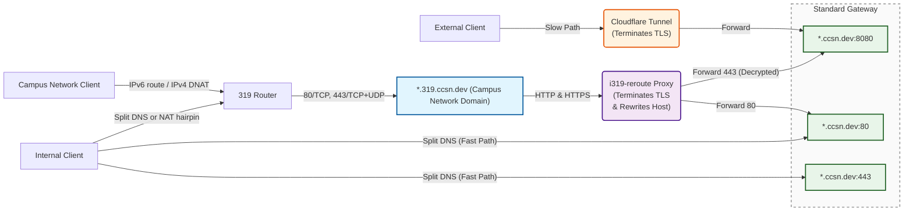

# Network Routing Architecture

This document outlines the ingress routing architecture for the cluster.
The design targets efficient handling of internal and external traffic,
using Split DNS for local access, Cloudflare Tunnel for public access, and a
direct campus dual-stack path via the 319 Router behind the campus firewall
and the i319-reroute proxy.

## Architecture Diagram

```mermaid
graph LR
    %% Clients
    Ext[External Client]
    Cam[Campus Network Client]
    Int[Internal Client]

    %% Middle Tier & Ingress
    CF_Tunnel("Cloudflare Tunnel<br/>(Terminates TLS)")
    319_router[319 Router]
    Domain_319["*.319.ccsn.dev (Campus Network Domain)"]
    319_reroute("i319-reroute Proxy<br/>(Terminates TLS<br/>& Rewrites Host)")

    %% Gateway (Rearranged node order to perfectly avoid line crossings)
    subgraph Gateway [Standard Gateway]
        GW_8080["*.ccsn.dev:8080"]
        GW_80["*.ccsn.dev:80"]
        GW_443["*.ccsn.dev:443"]
    end

    %% --- 1. Top Path ---
    Ext -->|"Slow Path"| CF_Tunnel
    CF_Tunnel -->|"Forward"| GW_8080

    %% --- 2. Middle Path (Includes i319-reroute routing) ---
    Cam -->|"IPv6 route / IPv4 DNAT"| 319_router
    Int -->|"Split DNS or NAT hairpin"| 319_router
    319_router -->|"80/TCP, 443/TCP+UDP"| Domain_319
    
    %% Domain receives 80 & 443 traffic and passes it to the proxy
    Domain_319 -->|"HTTP & HTTPS"| 319_reroute
    
    %% i319-reroute routing logic
    319_reroute -->|"Forward 443 (Decrypted)"| GW_8080
    319_reroute -->|"Forward 80"| GW_80

    %% --- 3. Bottom Path (Internal Direct) ---
    Int -->|"Split DNS (Fast Path)"| GW_80
    Int -->|"Split DNS (Fast Path)"| GW_443

    %% Style Definitions
    style Domain_319 fill:#e1f5fe,stroke:#01579b,stroke-width:2px
    style CF_Tunnel fill:#fff3e0,stroke:#e65100,stroke-width:2px
    style 319_reroute fill:#f3e5f5,stroke:#4a148c,stroke-width:2px
    style GW_80 fill:#e8f5e9,stroke:#1b5e20,stroke-width:2px
    style GW_443 fill:#e8f5e9,stroke:#1b5e20,stroke-width:2px
    style GW_8080 fill:#e8f5e9,stroke:#1b5e20,stroke-width:2px
    style Gateway fill:#fafafa,stroke:#9e9e9e,stroke-width:2px,stroke-dasharray: 5 5

```

## Traffic Flows

### 1. External Access (Slow Path)

* **Route:** External Client -> Cloudflare Tunnel -> Gateway (`:8080`)
* **Description:** Provides secure public access to `*.ccsn.dev` without exposing local ports. Cloudflare handles TLS termination.

### 2. Campus Dual-Stack Access (Fast Path)

* **IPv6 route:** Campus client -> 319 router route/filter -> the
  Cilium-allocated Service IPv6 -> `i319-reroute` -> Gateway.
* **IPv4 route:** Campus client -> 319 NAT router campus IPv4 -> DNAT to the
  Cilium `172.30.0.0/24` Service IPv4 -> `i319-reroute` -> Gateway.
* **Ports:** The firewall/NAT contract exposes 80/TCP, 443/TCP, and 443/UDP.
* **Description:** The proxy terminates TLS for HTTPS, rewrites the Host header
  to the canonical non-`.319` hostname, and sends decrypted HTTPS to Gateway
  port 8080 while plain HTTP uses port 80.

The campus firewall is upstream of the 319 router. It blocks unsolicited
external-to-campus access and performs campus-edge NAT. It does not expose the
`*.319` path to external networks; both address families are campus-internal
entry paths handled by the 319 router.

### 3. Internal Access (Split DNS Fast Path)

* **Route:** Internal Client -> Gateway (`:80` or `:443`)
* **Description:** Local network clients resolve `*.ccsn.dev` directly to the local gateway IP via Split DNS, avoiding proxy overhead entirely.

## Core Components

* **Cloudflare Tunnel:** Secures external IPv4/general traffic. Terminates TLS before forwarding to the local network.
* **Campus Firewall:** Blocks unsolicited external access to campus-internal
  networks and provides the campus edge NAT boundary.
* **319 Router:** Routes and filters IPv6, and DNATs the campus IPv4 entry to
  the Service's private LoadBalancer IPv4.
* **i319-reroute Proxy:** A dual-stack reverse proxy handling the
  `*.319.ccsn.dev` domain. Its primary jobs are TLS termination, Host header
  rewriting, and HTTP/HTTPS traffic splitting.
* **Standard Gateway:** The core entry point for the backend services.

## Gateway Port Mapping

| Port | Traffic Source | Description |
| --- | --- | --- |
| **80** | Internal Split DNS, `i319-reroute` | Standard plain HTTP traffic. |
| **443** | Internal Split DNS | Standard HTTPS traffic (Gateway handles TLS). |
| **8080** | Cloudflare Tunnel, `i319-reroute` | Decrypted HTTPS traffic forwarded from upstream proxies. |
