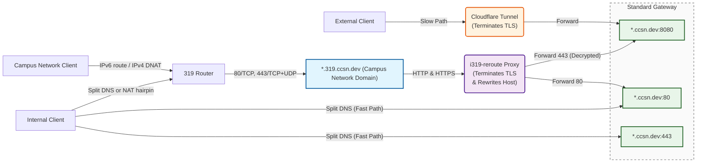

# Network Routing Architecture

This document outlines the ingress routing architecture for the cluster.
The design targets efficient handling of internal and external traffic,
using Split DNS for local access, Cloudflare Tunnel for public access, and a
direct campus dual-stack path via the 319 Router behind the campus firewall
and the i319-reroute proxy.

## Architecture Diagram


```mermaid
graph LR
    %% Clients
    Ext[External Client]
    Cam[Campus Network Client]
    Int[Internal Client]

    %% Middle Tier & Ingress
    CF_Tunnel("Cloudflare Tunnel<br/>(Terminates TLS)")
    319_router[319 Router]
    Domain_319["*.319.ccsn.dev (Campus Network Domain)"]
    319_reroute("i319-reroute Proxy<br/>(Terminates TLS<br/>& Rewrites Host)")

    %% Gateway (Rearranged node order to perfectly avoid line crossings)
    subgraph Gateway [Standard Gateway]
        GW_8080["*.ccsn.dev:8080"]
        GW_80["*.ccsn.dev:80"]
        GW_443["*.ccsn.dev:443"]
    end

    %% --- 1. Top Path ---
    Ext -->|"Slow Path"| CF_Tunnel
    CF_Tunnel -->|"Forward"| GW_8080

    %% --- 2. Middle Path (Includes i319-reroute routing) ---
    Cam -->|"IPv6 route / IPv4 DNAT"| 319_router
    Int -->|"Split DNS or NAT hairpin"| 319_router
    319_router -->|"80/TCP, 443/TCP+UDP"| Domain_319
    
    %% Domain receives 80 & 443 traffic and passes it to the proxy
    Domain_319 -->|"HTTP & HTTPS"| 319_reroute
    
    %% i319-reroute routing logic
    319_reroute -->|"Forward 443 (Decrypted)"| GW_8080
    319_reroute -->|"Forward 80"| GW_80

    %% --- 3. Bottom Path (Internal Direct) ---
    Int -->|"Split DNS (Fast Path)"| GW_80
    Int -->|"Split DNS (Fast Path)"| GW_443

    %% Style Definitions
    style Domain_319 fill:#e1f5fe,stroke:#01579b,stroke-width:2px
    style CF_Tunnel fill:#fff3e0,stroke:#e65100,stroke-width:2px
    style 319_reroute fill:#f3e5f5,stroke:#4a148c,stroke-width:2px
    style GW_80 fill:#e8f5e9,stroke:#1b5e20,stroke-width:2px
    style GW_443 fill:#e8f5e9,stroke:#1b5e20,stroke-width:2px
    style GW_8080 fill:#e8f5e9,stroke:#1b5e20,stroke-width:2px
    style Gateway fill:#fafafa,stroke:#9e9e9e,stroke-width:2px,stroke-dasharray: 5 5

```

## Traffic Flows

### 1. External Access (Slow Path)

* **Route:** External Client -> Cloudflare Tunnel -> Gateway (`:8080`)
* **Description:** Provides secure public access to `*.ccsn.dev` without exposing local ports. Cloudflare handles TLS termination.

### 2. Campus Dual-Stack Access (Fast Path)

* **IPv6 route:** Campus client -> 319 router route/filter -> the
  Cilium-allocated Service IPv6 -> `i319-reroute` -> Gateway.
* **IPv4 route:** Campus client -> 319 NAT router campus IPv4 -> DNAT to the
  Cilium `172.30.0.0/24` Service IPv4 -> `i319-reroute` -> Gateway.
* **Ports:** The firewall/NAT contract exposes 80/TCP, 443/TCP, and 443/UDP.
* **Description:** The proxy terminates TLS for HTTPS, rewrites the Host header
  to the canonical non-`.319` hostname, and sends decrypted HTTPS to Gateway
  port 8080 while plain HTTP uses port 80.

The campus firewall is upstream of the 319 router. It blocks unsolicited
external-to-campus access and performs campus-edge NAT. It does not expose the
`*.319` path to external networks; both address families are campus-internal
entry paths handled by the 319 router.

### 3. Internal Access (Split DNS Fast Path)

* **Route:** Internal Client -> Gateway (`:80` or `:443`)
* **Description:** Local network clients resolve `*.ccsn.dev` directly to the local gateway IP via Split DNS, avoiding proxy overhead entirely.

## Server Timing

HTTP proxies append their own `Server-Timing` measurements independently.
Nginx does not read Envoy-specific headers, and Envoy does not interpret Nginx
metrics. Existing `Server-Timing` values remain opaque and are preserved,
including application metrics and multiple proxy hops. Each metric's `desc`
identifies the emitting Pod; Nginx upstream metrics also identify the attempt.
All durations are milliseconds. Native Envoy duration formatters use whole
milliseconds; sub-millisecond intervals appear as zero. Nginx's source
variables also have millisecond resolution. No `Timing-Allow-Origin` or CORS
header is added.

Nginx uses lazy native `map` variables and `add_header` for single attempts;
only retries, upstream groups and partial measurements evaluate njs. Envoy uses
native timing formatters and Header Mutation.
A literal `;dur=;` search selects the missing-measurement path, avoiding a
regular-expression scan on complete measurements. Native header formatters
render absent durations as empty values (`omit_empty_values=true`), as defined
by [Envoy's header parser](https://github.com/envoyproxy/envoy/blob/c90c9e9ba9b26d6a40717689269fc0c3c9c5702d/source/common/router/header_parser.cc)
and [formatter](https://github.com/envoyproxy/envoy/blob/c90c9e9ba9b26d6a40717689269fc0c3c9c5702d/source/common/formatter/substitution_formatter.cc).
Complete measurements bypass header-to-metadata conversion; a native regex
omits unavailable measurements on the fallback path. Neither proxy
creates per-request script state on its normal path. Nginx preserves inherited
headers such as `Alt-Svc` with `add_header_inherit merge` (Nginx 1.29.3+).

| Metric | Measurement |
| --- | --- |
| `nginx_headers` | Request start until response headers are ready, including upstream waiting |
| `nginx_upstream_connect` | Upstream connection establishment, including TLS when used |
| `nginx_upstream_headers` | Upstream attempt start until its response headers arrive |
| `envoy_headers` | Stream start until response filter execution, including upstream waiting |
| `envoy_upstream_tcp` | Upstream TCP connection establishment |
| `envoy_upstream_tls` | Upstream TCP connected until TLS handshake completes |
| `envoy_upstream_pool` | Upstream request creation until its connection pool is ready |
| `envoy_upstream_headers` | First upstream request byte sent until first response byte received |
| `envoy_request_receive` | First through last downstream request byte received, when already available |

These intervals overlap; do not sum them. Missing measurements are omitted,
not reported as zero. Nginx emits available measurements for each retry;
Envoy's upstream measurements describe the selected upstream attempt, not a
complete retry trace. Envoy connection and TLS durations describe the underlying
connection and can repeat across requests that reuse it. Nginx reports zero
connect duration for a reused connection.

The root-namespace `server-timing` EnvoyFilter covers HTTP gateways and sidecars.
`waypoint-server-timing` attaches the same implementation to the
`istio-waypoint` GatewayClass, using Istio 1.30's `targetRefs` support. Pure
TCP/TLS passthrough and ztunnel do not modify HTTP headers. The current proxy
images do not expose separate downstream TLS handshake measurements in HTTP
responses; browser resource timing provides the browser-to-edge TCP/TLS times.
Nginx does not expose separate upstream TCP and TLS durations.

Metrics are emitted when response headers are sent. They do not measure the
complete response body or download, and do not buffer streaming responses.
Same-origin browser code can inspect them with:

```javascript
performance.getEntriesByType("navigation")[0]?.serverTiming;
performance.getEntriesByType("resource").map(entry => ({
  url: entry.name,
  timings: entry.serverTiming,
}));
```

Verification from the repository root:

```bash
node --test scripts/network/tests/server-timing.test.mjs
uv run --with pyyaml python -m unittest discover -s scripts/network/tests -p 'test_*.py' -v
kubectl kustomize infra/configs/overlays/kubevirt-cluster-319
```

The integration check starts isolated local test proxies using the production
Nginx image and matching Istio proxy version, verifies independent and chained
proxies, upstream TLS, reused connections, retries, error/local responses,
streaming, and all six Nginx locations. It performs no cluster writes. Test
containers are stopped and retained for inspection, with configs and logs under
the workspace's `task-logs/server-timing/` directory. Kustomize generates a
hashed ConfigMap for the Nginx timing module so module updates trigger a rollout.

The performance A/B harness compares the feature disabled/enabled for Nginx,
Envoy with a TLS upstream, and Nginx -> Envoy -> Envoy -> TLS upstream. It uses
a fast 256-byte backend, HTTP/1.1 keepalive, one worker per proxy, and separate
physical CPU cores for each hop and the load generators. `wrk` measures
saturation throughput across a connection-count sweep; Vegeta measures latency at a fixed
request rate. CPU time comes from container cgroup counters, and memory from
cgroup anonymous-memory samples. The benchmark includes both script execution
and the larger response headers. It is a local stress test, not a production
capacity estimate or an HTTP/2/3 benchmark.

```bash
nix shell nixpkgs#wrk nixpkgs#vegeta -c uv run --with pyyaml python \
  scripts/network/benchmark_server_timing.py \
  --output ../task-logs/server-timing-benchmark \
  --stage capacity --connections 16 64 256 --rounds 3 --duration 4 \
  --require-idle-builds
```

The harness needs at least six available physical cores. `--connections`
selects the capacity sweep (default: 16, 64, 256, 1024). `--cpus` can select six
distinct physical cores explicitly. It alternates test order, warms each
endpoint, validates response bodies and complete per-hop timing metrics, records available CPU frequency samples, and saves every completed
sample and its raw output. Rerunning the same command resumes the same run;
use a different output directory when changing parameters. `--stage capacity`,
`--stage latency`, and `--stage report` select individual stages. Test containers
are stopped and retained for inspection; no cluster configuration is changed.

For acceptance runs, wait for local compilation to finish and use
`--require-idle-builds`. It checks for build activity before and during load,
persists invalidation if a build starts, and refuses to report or resume that
invocation as an acceptance run. Retained `invalid.json` markers also prevent
reporting. Other host interference still needs to be excluded separately.

`--modes off on static` adds a constant-metric header control to separate header
costs from timing computation. Header byte counts are recorded for each mode;
static durations need not have exactly the same string length as measured ones.
The Envoy static control appends its complete metric list as one header field,
matching the current feature's own header layout.
`reference` mode runs a previous implementation with
`--reference-envoy-policy` and `--reference-nginx-timing-dir`; it uses the same
hop descriptions as the candidate for comparable header sizes.

The current acceptance budgets are **at most 5% Nginx peak throughput loss**
and **at most 10% Envoy peak throughput loss**, compared with the feature
disabled. These gates apply independently; chain measurements are diagnostic.
Each mode's capacity is the highest median throughput across the tested
connection counts. CPU/request is diagnostic data and is not an
acceptance gate. Equal-rate latency runs are optional.
A point estimate within the budget is not a statistical pass: a stable host
and enough repeatable samples are needed to establish the applicable limit.
New invocations record both component budgets in their immutable configuration;
historical reports retain the gate recorded for their original run.

For an acceptance result, use at least seven complete paired rounds and
`--require-idle-builds`. The report resamples paired rounds 5,000 times, reselects
each mode's peak over the connection sweep for every draw, and requires the
one-sided 95% bootstrap upper loss bound to fit the component budget. The
baseline range must also fit the budget. Short, incomplete, uncontrolled, or
noisy runs remain inconclusive; empty-filter diagnostics cannot pass feature
acceptance. This check describes the measured workload and host, not a universal
bound for every production workload.

Further native probes are recorded in
[the native probe summary](scripts/network/benchmarks/server-timing-native-probes-2026-10-09.json).
An empty shared-library filter on the pinned Istio image lost 5.8% at 64
connections across five alternating rounds, with a 0.32% baseline range. It
emits no Envoy timings and is only a diagnostic wrapper-cost control.
It is not a feature acceptance run or a shipped implementation.

The existing Istio image also validated a 501-byte independently compiled V8
Wasm plugin. Five compiler-idle alternating rounds at 64 connections measured
6.37% loss for its empty response callback, with a 0.94% disabled range. This is
a wrapper-only screening without Envoy timing metrics, not feature acceptance.
These probes contain no Envoy timing work and cannot establish compliance with
the complete-feature budget.

A native Nginx prototype reads upstream states directly, caches descriptions,
and appends to an existing opaque timing header. Its candidates passed eight
local integration checks; the cached-description sweep still lost 3.9%.
The earlier reported 1.2% improvement from reusing the existing header is
withdrawn: the native reference configuration accidentally loaded the candidate
binary. The harness now resolves native module paths against each mode's own
mount, records its own source hash, and refuses to resume samples taken with a
changed or unrecorded harness. Neither that screening nor the cached-description
sweep establishes a repeatable throughput limit.

Cached templates, configuration-owned caches, an O3 build, and an 8 KiB request
pool remain under investigation. The latest Nginx candidates each passed nine
integration checks, including configuration reload. Guarded template and O3/pool
runs were invalidated when Android compilation restarted; the latter completed
18 samples before invalidation. Those samples cannot establish capacity gains.
A subsequent compiler-idle Nginx O3/pool screening measured 2.6% peak throughput
loss. The disabled peak range spanned 27%, and identical reference/on controls
differed by 1.13% at peak. This does not establish a repeatable throughput limit;
further measurements need to control that variation.

The native Envoy formatter experiment is closed: it modifies the Envoy core and
requires rebuilding the complete proxy, whereas the required scope is a plugin
for the existing Istio/Envoy binary. That build was stopped. No replacement proxy
binary was produced or deployed. Prototype plugin binaries and raw outputs are
retained locally.

Two stock-image native candidates simplify helper concatenation or remove the
matcher wrapper around conversion. Each passed eight local integration checks.
Renewed Android builds invalidated the concatenation capacity comparisons;
the direct conversion completed a guarded 45-sample comparison after ten
continuous compiler-idle minutes. Across five alternating rounds and
16/64/256 connections, it lost 13.52% from disabled and 1.49% against the
retained policy. Its 10% point gate failed, so it is not shipped. The retained
policy lost 12.21% in the same comparison; neither policy passed the Envoy gate.

A standalone C ABI `.so` plugin uses the existing image's shared-library
filter interface without a Go runtime or rebuilding Envoy. It formats compact
native timing values, caches the hostname, and preserves opaque upstream fields.
After fixing configuration lifetime and including later response-filter waits,
it passed all nine stock-image integration checks with two workers. A local
package preserves the stock image's four layers and adds only the `.so` file;
the same nine checks passed without a plugin volume mount. It has not been
published or deployed. Its guarded seven-round capacity comparison completed
63 samples across 16/64/256 connections. Peak throughput loss was 12.48%, with
a one-sided 95% upper loss bound of 13.14%, failing the 10% gate. It was 1.51%
slower than the retained policy and is rejected. The retained policy lost
11.14% in the same comparison. A subsequent production Nginx comparison was
invalidated when compilation resumed after 21 samples; it has no acceptance result.

A complete 5,055-byte V8 Wasm candidate now uses the same native intervals and
appends opaque upstream fields without registering body callbacks. Eleven
integration checks passed on the stock image, including cold local replies,
response-filter waits, streaming, and 4,000 consecutive full-metric responses.
The same checks passed with inline bytecode and no plugin file mount, avoiding
an image change. All nine capacity fixture endpoints passed response preflight.
Its guarded seven-round capacity comparison lost 18.01%, with a one-sided
95% upper loss bound of 18.51%; it was 7.68% slower than the retained policy
and is rejected. The retained policy lost 11.18% in that same comparison.
A separate seven-round production Nginx comparison lost 7.88%, with a 95%
upper bound of 9.66%, failing the independent 5% gate. No runtime change
is shipped. The O3 native Nginx candidate passed ten integration checks. Its guarded
seven-round point loss was 3.16%, a 5.63% gain over the retained maps/njs
configuration, but high-concurrency variation raised the 95% upper loss
to 9.55%; its 5% acceptance remains inconclusive. A duplicate-port fixture failed
preflight before any load; port allocation now holds every reservation until
all roles have distinct ports, and seventeen benchmark regressions pass.


A native Envoy fallback candidate copies complete helpers directly and runs Lua
cleanup only for missing durations. Nine integration checks passed; renewed
compilation invalidated its capacity comparison after ten samples. It has no
throughput conclusion. A separate C ABI candidate caches complete and plaintext
formatting templates, using the general path for larger or other missing values.
Four explicit formatting/capacity checks, ten integration checks with two workers
(including 2,000 sustained full-metric replies), and all nine fixture preflights
passed. Thirteen preflight containers were stopped. Its capacity comparison,
a fourteen-round Nginx precision replication, and a fresh fallback comparison
are queued after the continuous compiler-idle window. None is shipped or accepted.

The 2026-10-09 retained-candidate run used three alternating rounds of
4-second samples at 16, 64, and 256 connections on an Intel i7-14650HX. Each
mode's reported capacity is its highest median across the sweep. The applicable
throughput acceptance result is **not passed**:

| Scenario | Disabled req/s | Enabled req/s | Throughput change |
| --- | ---: | ---: | ---: |
| Nginx | 81,154 | 78,149 | -3.7% |
| Envoy → TLS backend | 37,249 | 31,834 | -14.5% |
| Nginx → Envoy → Envoy → TLS backend | 36,456 | 27,524 | -24.5% |

Envoy's peak point estimate is 1.4% higher than the previous implementation;
the chain differs by -0.3%, within the observed variation. Nginx is unchanged,
and its identical `reference` and `on` implementations differ by 3.1% in peak
estimates. Baseline ranges span 2.3–3.8%, so these workstation measurements
cannot establish the current throughput limits. No sample reported socket
errors, HTTP failures, or proxy CPU throttling. CPU/request is not part of acceptance.

[Recorded throughput summary](scripts/network/benchmarks/server-timing-throughput-2026-10-09.json)
includes capacity curves, ranges, source hashes, tool versions, and images.
Raw samples and per-role CPU frequency readings are under the workspace's
`task-logs/server-timing-throughput-retained/` directory. The recorded checkout
precedes the candidate commit; file hashes identify the measured sources.
Reference sources are snapshots from commit `ffa188e`.

A subsequent literal-matcher run compared the candidate with `ac1c9bb` and
the feature disabled. It used CPUs 16–21 (six physical cores without SMT
siblings), three alternating rounds of 4-second samples, and the same
16/64/256-connection sweep. The highest median for each mode was at 64
connections. The Envoy 10% budget remains **not passed**:

| Scenario | Disabled req/s | Previous req/s | Candidate req/s | From previous | From disabled |
| --- | ---: | ---: | ---: | ---: | ---: |
| Envoy → TLS backend | 12,948 | 11,349 | 11,493 | +1.3% | -11.2% |
| Nginx → Envoy → Envoy → TLS backend | 12,248 | 9,271 | 9,525 | +2.7% | -22.2% |

These are exploratory point estimates: baseline peak ranges span 3.9–4.2%,
larger than the apparent improvements. The host is shared, and these results
cannot establish stable gains or the applicable throughput limit. Nginx's
timing implementation is unchanged. No sample reported socket errors, HTTP failures, or proxy CPU
throttling.

[Literal-matcher summary](scripts/network/benchmarks/server-timing-throughput-literal-2026-10-09.json)
records source hashes, curves, ranges, and the reference commit. All nine
endpoints' recorded timing values were checked against the fixture's expected
metrics. Raw samples are under `task-logs/server-timing-throughput-literal-ecores/`.
The preceding run on CPUs 0/2/4/6/8/10 was invalidated: concurrent compilation
reduced disabled Envoy throughput from 38,246 to 1,073 req/s. Its artifacts
remain under `task-logs/server-timing-throughput-literal/` and are excluded
from performance conclusions.

The benchmark now rejects invalid durations, missing hop metrics, and leaked
private helpers before generating load. Four regression checks cover these
failures and valid zero durations. The original matcher-gated Lua experiment
failed missing-value conversion and its performance results were discarded;
the corrected candidate passed integration checks but reduced chain throughput
relative to the native candidate. A compact-helper Lua reconstruction also
lacked repeatable throughput evidence. The retained policy uses native filters.

Chrome's navigation and resource APIs each exposed all 16 metrics in the
integration chain, preserving an application description containing a comma.
A local 401 response also exposed its available timings without inventing
upstream measurements. Browser artifacts are under
`task-logs/server-timing-browser/` in the workspace.

The earlier fixed-64-connection run is retained in the
[historical summary](scripts/network/benchmarks/server-timing-2026-10-09.json).
It also evaluated the former CPU/request budget. The current acceptance gate
uses throughput only, and evaluates peak medians across a connection sweep.

The retained implementation keeps Nginx's generic native map. Experimental
exact-value maps had inconsistent throughput results and were discarded. Envoy
bypasses metadata conversion for complete measurements and emits its own
metrics in one header. Missing measurements use a single native regex; all
available intervals and opaque upstream values remain present on every response.

Local measurements do not establish both current throughput limits. Test containers are stopped
and retained; no cluster configuration is changed. `--scenarios` selects paths,
`--envoy-policy` and `--nginx-timing-dir` select workspace-local candidates, and
changing timing sources invalidates resume. The pinned Istio image does not
include the dynamic HTTP module extension, as verified with configuration
validation; loading a native Envoy module would require a different proxy image.

`--stage prepare` validates the response headers for every selected mode's
standalone and chain paths, verifies the fixture's CPU affinity, and stops the
retained containers without generating load or a throughput report. The
standalone C ABI candidate passed this preflight for all nine disabled,
reference, and enabled endpoints; capacity acceptance remains pending.

## Core Components

* **Cloudflare Tunnel:** Secures external IPv4/general traffic. Terminates TLS before forwarding to the local network.
* **Campus Firewall:** Blocks unsolicited external access to campus-internal
  networks and provides the campus edge NAT boundary.
* **319 Router:** Routes and filters IPv6, and DNATs the campus IPv4 entry to
  the Service's private LoadBalancer IPv4.
* **i319-reroute Proxy:** A dual-stack reverse proxy handling the
  `*.319.ccsn.dev` domain. Its primary jobs are TLS termination, Host header
  rewriting, and HTTP/HTTPS traffic splitting.
* **Standard Gateway:** The core entry point for the backend services.

## Gateway Port Mapping

| Port | Traffic Source | Description |
| --- | --- | --- |
| **80** | Internal Split DNS, `i319-reroute` | Standard plain HTTP traffic. |
| **443** | Internal Split DNS | Standard HTTPS traffic (Gateway handles TLS). |
| **8080** | Cloudflare Tunnel, `i319-reroute` | Decrypted HTTPS traffic forwarded from upstream proxies. |
