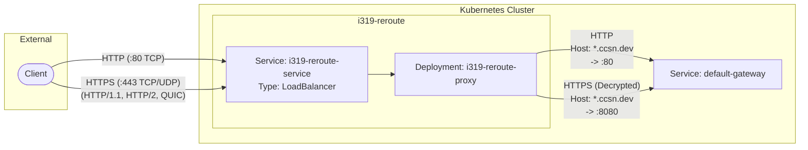

# i319-reroute

A lightweight edge routing layer in Kubernetes for host rewriting and TLS termination.

**Purpose:** Routes inbound traffic from `*.319.ccsn.dev` to the standard external gateway handling `*.ccsn.dev`, acting as a pass-through proxy.

## Architecture Data Flow



## Routing Logic

The system utilizes Nginx to perform host rewriting before proxying the connection to the upstream Envoy gateway.

### Host Rewriting

* **Production:** Matches `*.319.ccsn.dev` and rewrites the `Host` header to `*.ccsn.dev`.
* **Staging:** Matches `*.319.staging.ccsn.dev` and rewrites the `Host` header to `*.staging.ccsn.dev`.
* **Infrastructure overlays:** Match `*.clustername.319.ccsn.dev` and rewrite the `Host` header to `*.clustername.ccsn.dev`.
* **Header Injection:** Appends `X-Real-IP`, `X-Forwarded-For`, and dynamically sets `X-Forwarded-Proto` based on the ingress scheme.

### Port Mapping

| Ingress Protocol | Ingress Port | Nginx Listener | Upstream Target | Upstream Port |
| --- | --- | --- | --- | --- |
| HTTP | `80 (TCP)` | `listen 80;` | `default-gateway` | `80` |
| HTTPS (H1/H2) | `443 (TCP)` | `listen 443 ssl http2;` | `default-gateway` | `8080` |
| HTTPS (QUIC) | `443 (UDP)` | `listen 443 quic reuseport;` | `default-gateway` | `8080` |

## Kubernetes Resources

* **`cert-manager.io/v1/ClusterIssuer` & `Certificate`**:
Automates Let's Encrypt Wildcard certificate generation via DNS-01 challenge. Stored in `isning-moe-tls-secret`.
* **`v1/ConfigMap` (`i319-reroute-nginx-config`)**:
Contains the bare `nginx.conf` handling TLS termination, ALPN (H2/H3), host rewriting, and pass-through routing to the upstream gateway.
* **`apps/v1/Deployment` (`i319-reroute-proxy`)**:
Runs the Nginx proxy pods. Exposes ports 80 (TCP), 443 (TCP), and 443 (UDP).
* **`v1/Service` (`i319-reroute-service`)**:
`LoadBalancer` type. Maps external ports 80/TCP, 443/TCP, and 443/UDP to the deployment pods.

## i319-reroute, Why there's a i prefix?
```txt
Service/319-reroute/319-reroute dry-run failed (Invalid): Service "319-reroute" is invalid: metadata.name: Invalid value: "319-reroute": a DNS-1035 label must consist of lower case alphanumeric characters or '-', start with an alphabetic character, and end with an alphanumeric character (e.g. 'my-name',  or 'abc-123', regex used for validation is '[a-z]([-a-z0-9]*[a-z0-9])?')
```
That's all.
