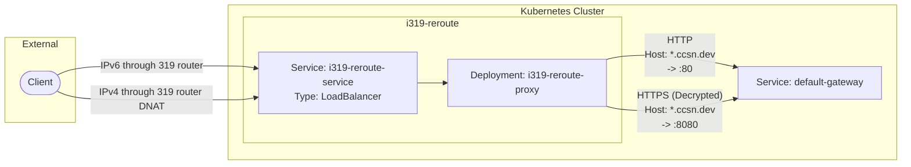

# i319-reroute

A lightweight dual-stack campus edge routing layer in Kubernetes for host
rewriting and TLS termination.

**Purpose:** Routes inbound campus traffic from `*.319.ccsn.dev` to the
standard external gateway handling `*.ccsn.dev`, acting as a reverse proxy.

## Campus dual-stack exposure

The `LoadBalancer` Service requires both address families. IPv6 is the primary
family and is allocated from the Cilium IPv6 pool routed by the 319 router.
In the `kubevirt-cluster-319` overlay, IPv4 is pinned to `172.30.0.201` by a
dedicated Cilium pool selected by the Service label
`networking.ccsn.dev/lb-pool: i319-reroute`. The ordinary IPv4 pool excludes
this address and Services with this label. IPv6 remains dynamically allocated
from the public IPv6 pool. Do not add `lbipam.cilium.io/ips` or
`spec.loadBalancerIP`: explicit IP requests in the deployed Cilium version
prevent dynamic allocation of the other family.

Configure the OpenWrt port forwards for 80/TCP, 443/TCP and 443/UDP with
`172.30.0.201` as their destination. Changing the pools can reassign existing
LB addresses; verify the allocated addresses and update the router target
when cutting over. Check that another Service does not already own
`172.30.0.201` before deploying the reservation.

| Client family | 319 router entry | Cluster backend | Router contract |
| --- | --- | --- | --- |
| IPv6 | routed Service LoadBalancer IPv6 | same IPv6 address | 319 router routes and filters 80/TCP, 443/TCP and 443/UDP |
| IPv4 | 319 NAT router campus IPv4 | Service LoadBalancer IPv4 | DNAT forwards 80/TCP, 443/TCP and 443/UDP |

Both paths enter through the 319 router and remain inside the campus security
boundary. The upstream campus firewall blocks unsolicited access from external
networks to campus-internal services and performs campus-edge NAT; it does not
publish `*.319` as an external ingress. The private `172.30.0.0/24` address is
not a client-facing DNS target. Campus DNS A records resolve to the 319 router's
campus IPv4 address; AAAA records resolve to the Service IPv6 routed by that
router.

### DNS and OpenWrt DDNS

The cluster overlay uses `ingress.319.ccsn.dev` as the shared dual-stack entry.
The three campus wildcard names are CNAME records pointing to this entry,
managed by the ordinary ExternalDNS instance from the overlay's DNSEndpoint.
Cloudflare proxying is disabled on these records and on the entry.

| Entry record | Target | Writer |
| --- | --- | --- |
| `ingress.319.ccsn.dev` A | OpenWrt campus-facing IPv4 | OpenWrt DDNS |
| `ingress.319.ccsn.dev` AAAA | Service LoadBalancer IPv6 | `external-dns-campus` |

The campus ExternalDNS instance only reads Services in `i319-reroute` with
`networking.ccsn.dev/dns-scope: campus`, only manages AAAA records under the
entry name, and uses a separate TXT owner and prefix. The ordinary instance
excludes these Services and the entry name. Neither instance manages the
entry's A record, so DDNS updates are not overwritten. The Service's private
LB IPv4 is never published as the campus entry's A record.

On OpenWrt, keep the existing DDNS service and add a separate IPv4 service in
LuCI under **Services > Dynamic DNS**:

1. Ensure `ddns-scripts-cloudflare` and CA certificates are installed. Use the
   Cloudflare provider `cloudflare.com-v4` (the suffix is the API version).
2. In Cloudflare, create a DNS-only A record for `ingress.319.ccsn.dev` using
   the router's current campus-facing IPv4. Do not create a CNAME at this name.
3. Set the lookup hostname to `ingress.319.ccsn.dev`, the update domain to
   `ingress.319@ccsn.dev`, username to `Bearer`, and password to a Cloudflare
   API token with Zone Read and DNS Edit access to the `ccsn.dev` zone. Enter
   the token on the router; do not store plaintext credentials in Git.
4. Disable IPv6 updates for this DDNS service. Select the interface carrying
   the router's campus-facing IPv4 as the address source and update trigger.
   Do not use an Internet IP-check service: it may return the upstream campus
   NAT's public address rather than this router's campus address.
5. Enable the service, save/apply and verify its log reports a successful A
   update. Keep the port-forward destinations at `172.30.0.201`.

The first DDNS update is an external bootstrap step; it is not performed by
Flux. Configure the entry A record before switching existing wildcard names
to the CNAMEs. Reconciliation replaces the previous wildcard A/AAAA records
with CNAMEs; if unowned records block that change, review their ownership and
remove the conflicting legacy records in Cloudflare during the cutover.
A CNAME cannot coexist with A or AAAA records at the same name.

Verify the entry A matches the router interface and the entry AAAA matches
the Service's current LB IPv6. Verify all three wildcard paths over IPv4 and
IPv6, including HTTPS and QUIC. DNS changes follow the DDNS polling interval,
ExternalDNS reconciliation interval and resolver TTLs.

After reconciliation, record both addresses and verify the NAT/firewall path:

```bash
kubectl -n i319-reroute get service i319-reroute -o wide
```

External services use canonical `*.ccsn.dev` HTTPRoutes attached to the existing
production Gateway, alongside their ServiceEntries under the production app
overlay's `external-services/`. Campus access to `foo.319.ccsn.dev` enters this
Nginx proxy, which rewrites Host to `foo.ccsn.dev` and forwards HTTPS traffic
after TLS termination to the existing Gateway HTTP listener on port 8080.
The Gateway then routes to the external backend. No per-service campus
listener or hostname list is needed. The production Nginx path forwards
WebSocket upgrades and streams large uploads with one-hour read/write inactivity
timeouts. Reload or roll out the Nginx Deployment when changing its ConfigMaps.

K3s CoreDNS imports the overlay's `coredns-custom` ConfigMap. Its `local.override`
forwards `.local` queries to the OpenWrt DNS server at `192.168.1.1`; other
queries continue using the existing upstreams. `cluster.local` is excluded
from forwarding to the router, preserving Kubernetes service discovery.
Verify router DNS resolution from the Gateway Pod's network before cutting
over any external service.

## Architecture Data Flow


```mermaid
graph LR
    subgraph External
        Client([Client])
    end

    subgraph Kubernetes Cluster
        subgraph i319-reroute
            LB[Service: i319-reroute-service<br/>Type: LoadBalancer]
            
            RerouteProxy[Deployment: i319-reroute-proxy]

        end
        GatewaySVC[Service: default-gateway]
    end

    Client -- "IPv6 through 319 router" --> LB
    Client -- "IPv4 through 319 router DNAT" --> LB
    
    LB --> RerouteProxy
    
    RerouteProxy -- "HTTP<br/>Host: *.ccsn.dev<br/>-> :80" --> GatewaySVC
    RerouteProxy -- "HTTPS (Decrypted)<br/>Host: *.ccsn.dev<br/>-> :8080" --> GatewaySVC

```

## Routing Logic

The system utilizes Nginx to perform host rewriting before proxying the connection to the upstream Envoy gateway.

### Host Rewriting

* **Production:** Matches `*.319.ccsn.dev` and rewrites the `Host` header to `*.ccsn.dev`.
* **Staging:** Matches `*.319.staging.ccsn.dev` and rewrites the `Host` header to `*.staging.ccsn.dev`.
* **Infrastructure overlays:** Match `*.clustername.319.ccsn.dev` and rewrite the `Host` header to `*.clustername.ccsn.dev`.
* **Header Injection:** Appends `X-Real-IP`, `X-Forwarded-For`, and dynamically sets `X-Forwarded-Proto` based on the ingress scheme.

### Port Mapping

| Ingress Protocol | Ingress Port | Nginx Listener | Upstream Target | Upstream Port |
| --- | --- | --- | --- | --- |
| HTTP | `80 (TCP)` | `listen 80;` | `default-gateway` | `80` |
| HTTPS (H1/H2) | `443 (TCP)` | `listen 443 ssl http2;` | `default-gateway` | `8080` |
| HTTPS (QUIC) | `443 (UDP)` | `listen 443 quic reuseport;` | `default-gateway` | `8080` |

## Kubernetes Resources

* **`cert-manager.io/v1/ClusterIssuer` & `Certificate`**:
Automates Let's Encrypt Wildcard certificate generation via DNS-01 challenge. Stored in `isning-moe-tls-secret`.
* **`v1/ConfigMap` (`i319-reroute-nginx-config`)**:
Contains the bare `nginx.conf` handling TLS termination, ALPN (H2/H3), host rewriting, and pass-through routing to the upstream gateway.
* **`apps/v1/Deployment` (`i319-reroute-proxy`)**:
Runs the Nginx proxy pods. Exposes ports 80 (TCP), 443 (TCP), and 443 (UDP).
* **`v1/Service` (`i319-reroute`)**:
Dual-stack `LoadBalancer` type. Maps 80/TCP, 443/TCP, and 443/UDP to the
deployment pods. The IPv4 address is a NAT backend; IPv6 is directly routed.
Both paths are handled by the 319 router inside the campus firewall boundary.

## i319-reroute, Why there's a i prefix?
```txt
Service/319-reroute/319-reroute dry-run failed (Invalid): Service "319-reroute" is invalid: metadata.name: Invalid value: "319-reroute": a DNS-1035 label must consist of lower case alphanumeric characters or '-', start with an alphabetic character, and end with an alphanumeric character (e.g. 'my-name',  or 'abc-123', regex used for validation is '[a-z]([-a-z0-9]*[a-z0-9])?')
```
That's all.
